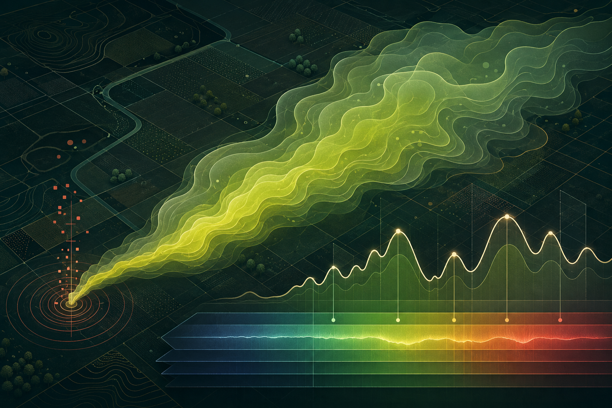

# MethaneLens

**Explainable methane plume detection from hyperspectral imagery.**



MethaneLens is an interactive research prototype built for OpenAI Build Week 2026. It turns a transparent hyperspectral benchmark into a complete review workflow: spectral inspection, methane-candidate segmentation, model comparison, reproducible metrics, and a grounded analyst brief.

> This is a research and decision-support prototype. It is not an operational leak-warning system and does not estimate emission rates.

## Why this project exists

Hyperspectral methane detection has a gap between model output and analyst action. A probability mask alone does not explain which spectral evidence mattered, how sensitive the result is to a threshold, or which verification step should follow. MethaneLens presents those pieces together in one runnable experience.

The scientific direction was inspired by the public [STARCOP project](https://github.com/spaceml-org/STARCOP). The current competition demo intentionally uses **original synthetic data** so it is small, deterministic, quick to test, and free of ambiguous redistribution rights.

## What the demo actually does

- Generates three deterministic 64 × 64 × 56 hyperspectral scenes covering 2.00–2.45 μm.
- Injects a documented methane-like absorption signature and a spatial plume field into two scenes.
- Includes a methane-free mineral-confounder control scene.
- Computes a classical spectral matched-filter baseline.
- Trains a lightweight logistic pixel classifier with gradient descent on a separate seeded calibration scene.
- Adds spatial context through a local probability smoother.
- Calculates Dice, ROC–AUC, precision, recall, and false-positive counts at an adjustable threshold.
- Lets the analyst click any pixel and compare its spectrum with the scene median.
- Exports the evidence, model settings, metrics, and limitations as a JSON case file.

The UI labels synthetic inputs, model probabilities, and limitations explicitly. It never presents probability as methane concentration.

## Run locally

Requirements: Node.js 20 or newer.

```bash
npm install
npm run dev
```

Open the local URL printed by vinext (by default, `http://localhost:5173`).

## Test and build

```bash
npm test
npm run build
npm run preview
```

## How Codex and GPT-5.6 were used

The project was created during OpenAI Build Week in a single primary Codex Work thread using GPT-5.6 Sol. Codex helped with:

- reducing a broad research topic into a testable competition scope;
- designing the data provenance and non-operational safety boundary;
- implementing the seeded hyperspectral simulator and methane target signature;
- implementing the matched-filter and gradient-descent classifier paths;
- building the responsive React interface and SVG/canvas visualizations;
- adding deterministic tests, export logic, documentation, and deployment preparation;
- reviewing the product language so model scores are not misrepresented as physical concentration.

Key product decisions remained human-directed: the original methane-detection research direction, the intended analyst audience, the final project name, the category, and what to submit publicly.

## Repository map

```text
src/
  components/        map and spectrum visualizations
  lib/
    simulation.ts    seeded cube, features, calibration and inference
    metrics.ts       evaluation metrics
    report.ts        grounded structured brief
  App.tsx            application workflow
  styles.css         responsive product UI
app/
  layout.tsx         hosted application shell and metadata
  page.tsx           product entry route
scripts/
  prepare-sites.mjs  Sites deployment manifest packaging
```

The interface is a React 19 client application packaged with vinext for the
OpenAI Sites runtime. No database, external dataset, or API key is required for
the competition demo.

## Scientific and product limitations

- The included scenes are synthetic and are not a substitute for STARCOP, EMIT, or AVIRIS-NG evaluation.
- The simplified reflectance simulator does not model a complete atmosphere or instrument response.
- Pixel-wise calibration is suitable for an interactive demo, not an operational validation claim.
- Ground-truth labels are used only for benchmark metrics, never as an inference input.
- Field action requires calibrated data, independent confirmation, and qualified analyst review.

## Next steps

1. Add an optional STARCOP/EMIT adapter without redistributing source datasets.
2. Compare SVM, XGBoost, and compact CNN models on spatially separated evaluation tiles.
3. Add PCA/ICA experiments and wavelength-level SHAP explanations.
4. Add a server-side GPT-5.6 narrative layer that consumes only the structured evidence object.
5. Export a signed, citation-aware analyst report.

## License

Project code is released under the MIT License. Third-party datasets are not included.
